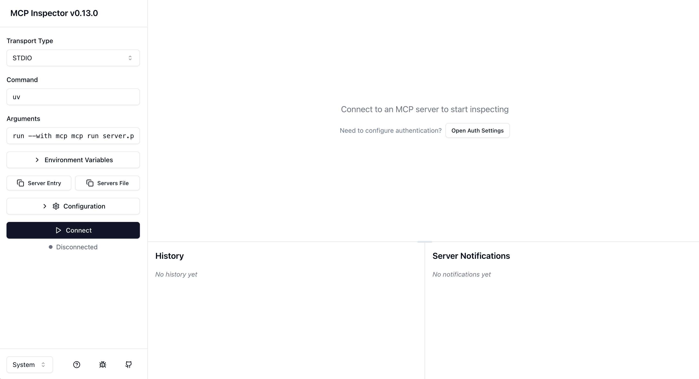
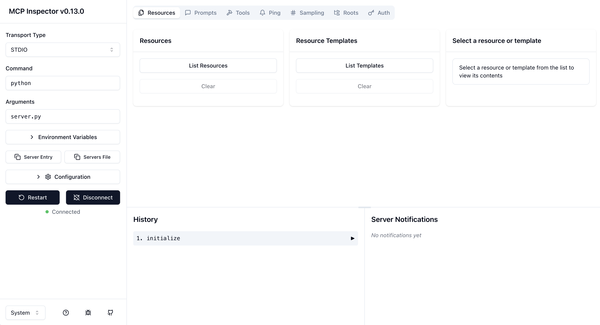

# MCP (Model Context Protocol) Python SDK Example

This simple server example is also based on the Hugging Face MCP course, but for those of us who don't want to jump in with `uv`, it’s unclear how to start the server without it.
So here’s **my** interpretation of how to use the **MCP Inspector** — without `uv`.

## Requirements
- Python
- Node.js (confusing, right?)

## How to run

1. Start the server
 
```bash
mcp dev server.py
```
> If it's your first time running this, you'll be prompted to install some dependencies for the MCP Inspector.  
> Just type `"y"` and press `Enter`.

2. In your browser go to http://127.0.0.1:6274/. You will see something like this:   
<br>



<br>

3. Set the following fields:

- **Command**: `python` 
- **Arguments**: `server.py`

4. Click **Connect**  

### And voilà! 🎉  
<br>



<br>

You can now explore the capabilities defined in your server.  
You can also try them out here.  
Simply click `List <capability-name>` and you'll figure out the rest.  


